# FyndRadarn

FyndRadarn is a portfolio project focused on building a modern full-stack web application for tracking product prices across multiple online stores.

Users can create anonymous price watchlists by providing an email address and a product URL. The application automatically monitors product prices and sends email notifications when prices change.

> 🚧 This project is under active development. MVP 1 and MVP 2 are complete, and additional features and improvements are planned for future releases.

## Current Status

MVP 1 and MVP 2 have been completed and include the complete anonymous price tracking workflow with an improved user experience.

Users can:
- Create anonymous watchlists
- Preview product information before creating a watchlist
- View their existing watchlists
- Track products from multiple online stores
- View product images and current prices
- See when a product was last checked
- View price change history
- Delete existing watchlists
- Receive confirmation emails
- Automatically receive email notifications when prices change

## Project Goals

FyndRadarn aims to provide users with a simple way to:

- Create and manage personal watchlists.
- Track products from different stores.
- Set target prices.
- Monitor price history and trends.
- Receive notifications when products reach a target price.
- Filter and sort tracked products.
- Manage user accounts and preferences.

## Features

- Create anonymous price watchlists
- Preview product information before watchlist creation
- Automatic product price parsing
- Scheduled price monitoring
- Display product images
- Display latest price check timestamp
- Display price change history
- Delete existing watchlists
- Support multiple online stores
- Email confirmation when creating a watchlist
- Email notifications on price changes
- PostgreSQL persistence

## Tech Stack

### Frontend

- React
- React Router
- JavaScript (ES6+)
- CSS

### Backend

- Node.js
- Express
- Playwright
- PostgreSQL (`pg`)
- dotenv

### Database

- PostgreSQL (Supabase)

## External Services

- [Logo.dev](https://logo.dev/) - Used for displaying store logos

## Roadmap

### ✅ MVP 1 - Anonymous Price Tracking (Completed)

- [x] Enter email address
- [x] Paste product URL
- [x] Validate submitted data
- [x] Fetch current product price
- [x] Create a watchlist
- [x] Store watchlist in PostgreSQL
- [x] Display successful watchlist creation
- [x] Run scheduled price checks
- [x] Detect price changes
- [x] Send confirmation email
- [x] Send price change notifications

### ✅ MVP 2 - Improved User Experience (Completed)

- [x] Support additional online stores
- [x] Display product images
- [x] Display latest price check timestamp
- [x] Display price change history
- [x] Delete existing watchlists
- [x] Improve email templates
- [x] Improve loading and error states

## Demo 
### MVP 2
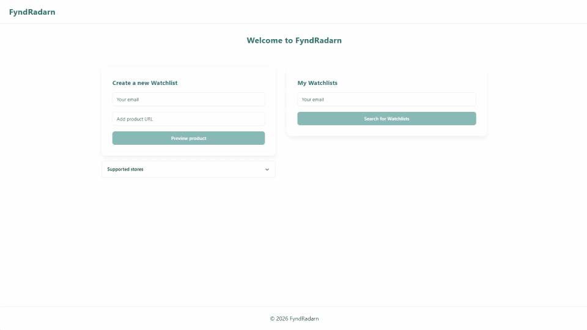

[▶️ Watch full demo](assets/mvp2-fyndradarn-demo.mp4) 

### MVP 1
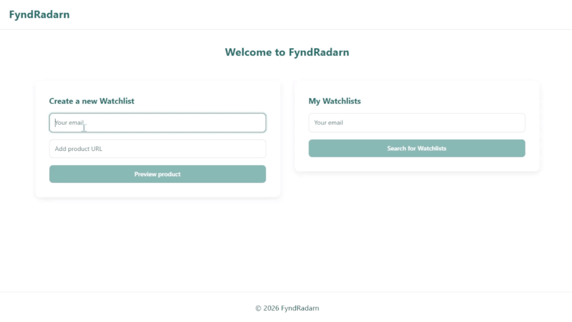

[▶️ Watch full demo](assets/mvp1-fyndradarn-demo.mp4) 

## Screenshots 

### MVP 2
#### Home Page
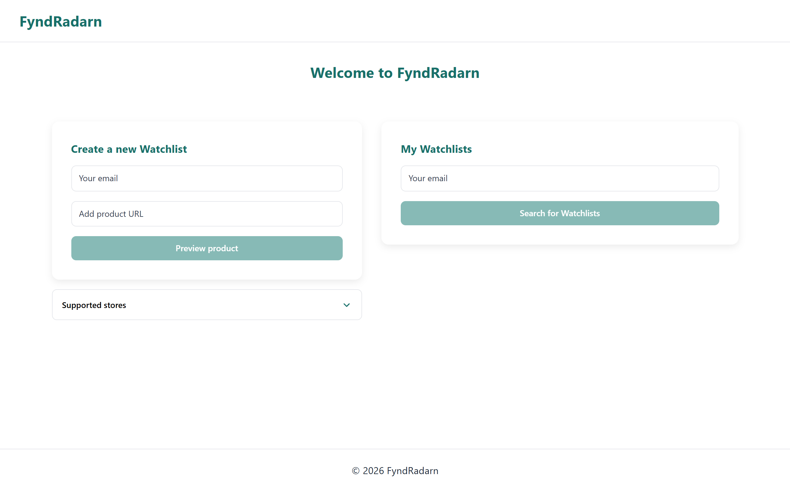
#### Product Preview
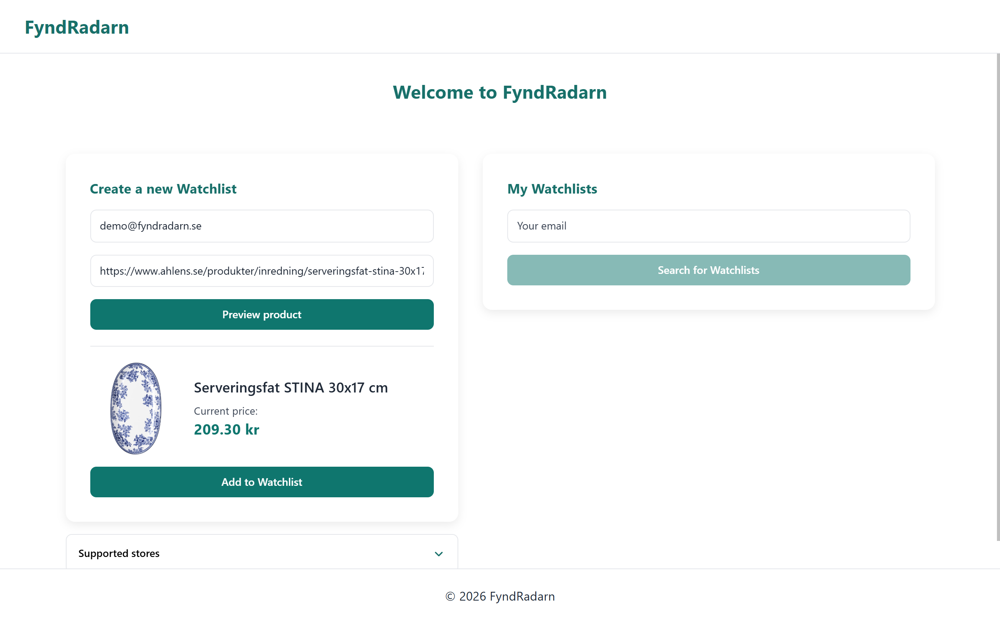
#### My Watchlists
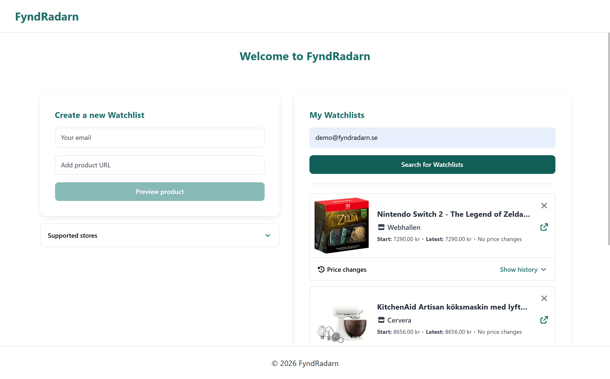
#### Unsupported store
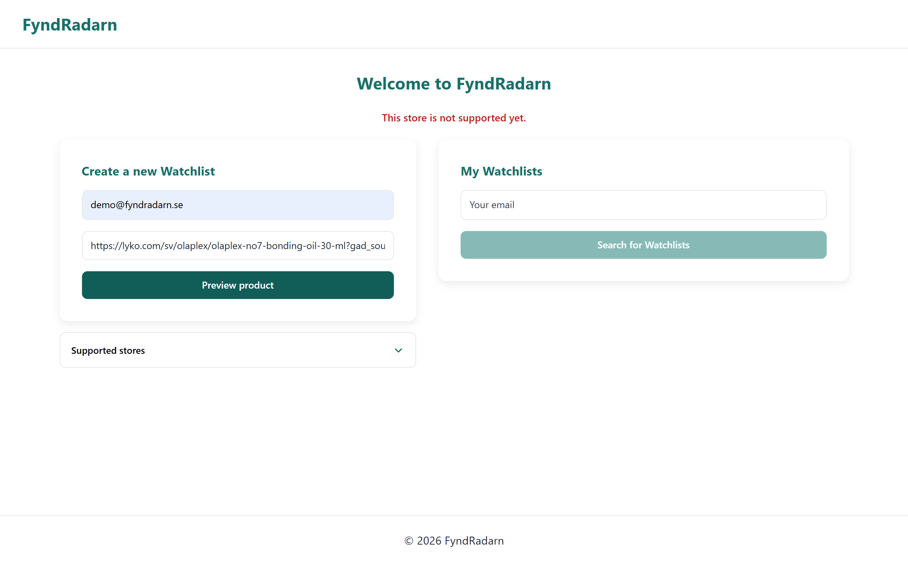
#### Confirmation email
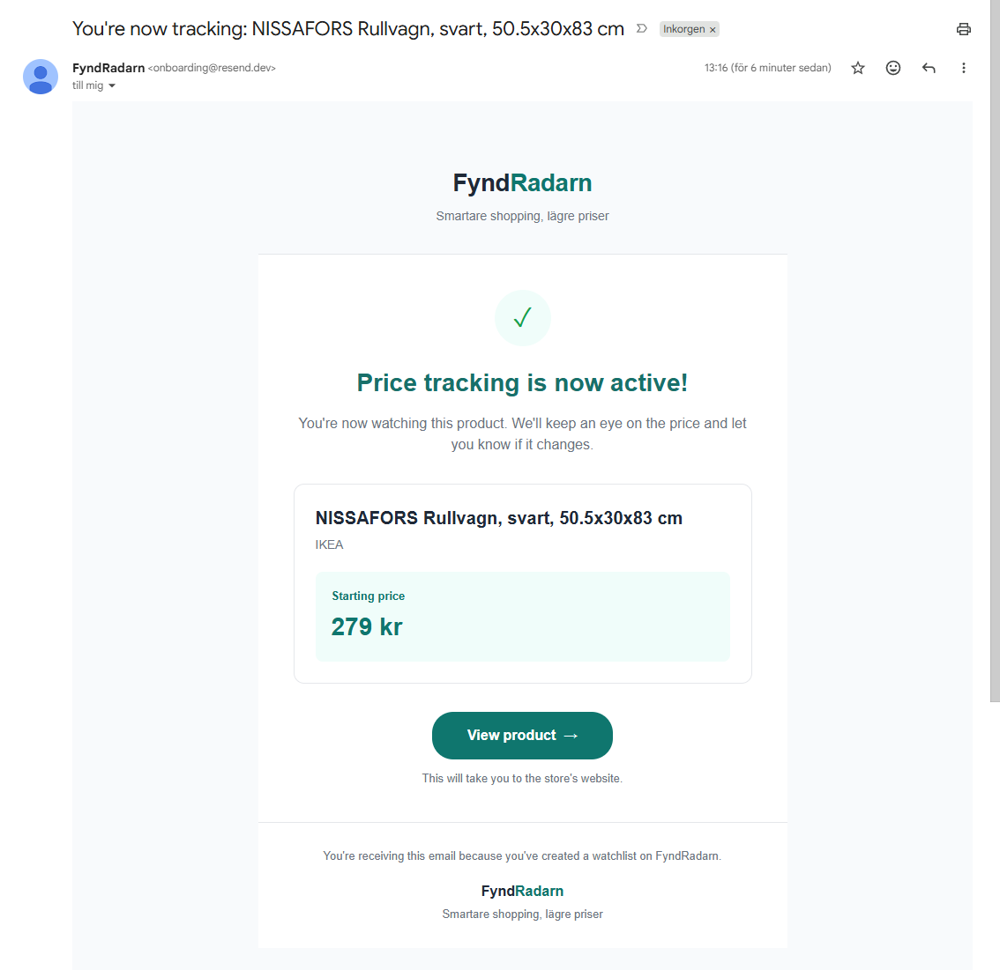
#### Price Change email
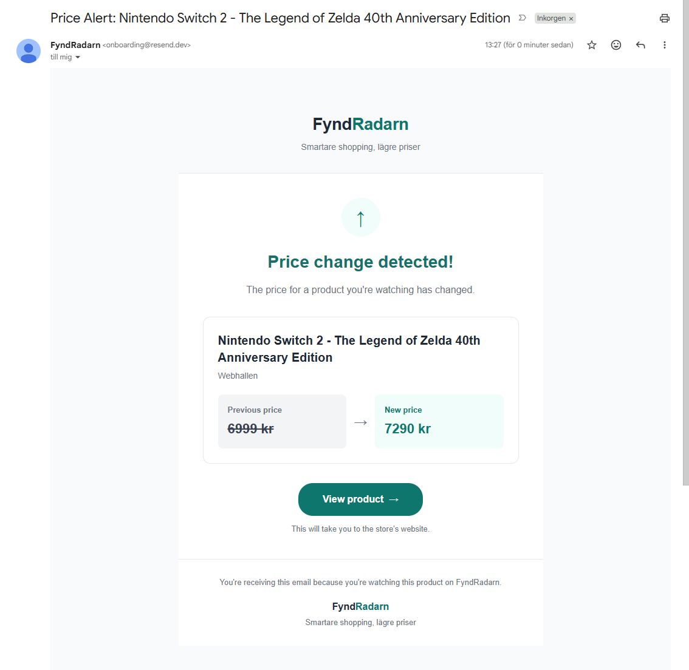

### MVP 1

#### Home Page
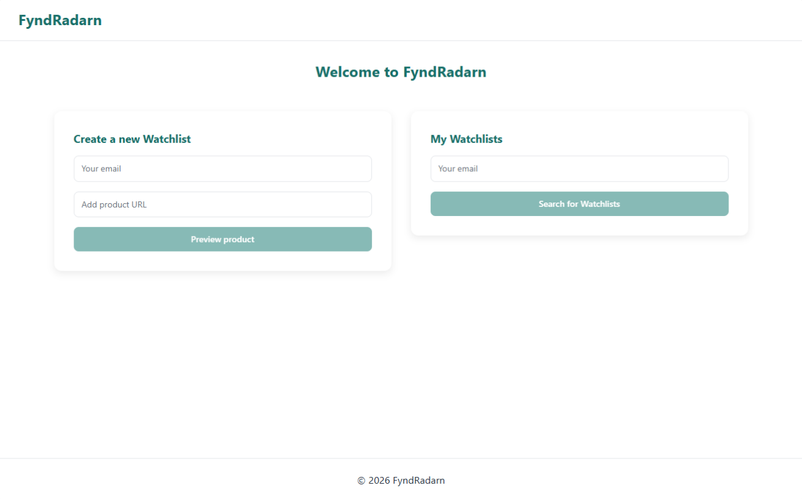
#### Product Preview
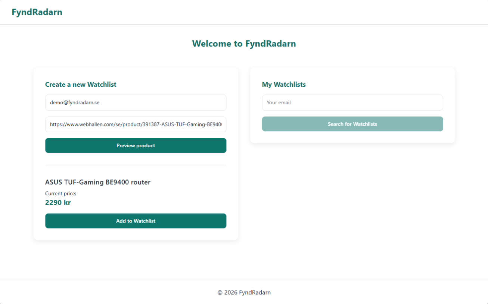
#### My Watchlists
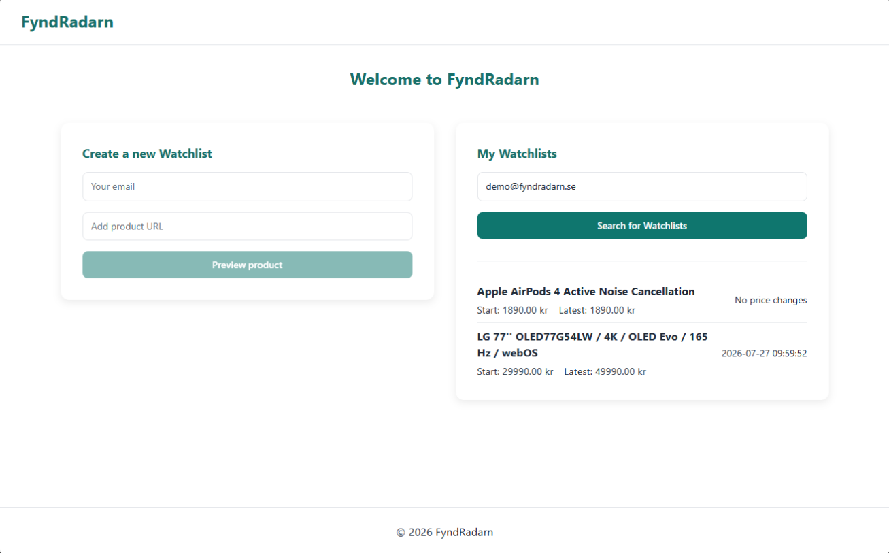
#### Unsupported store
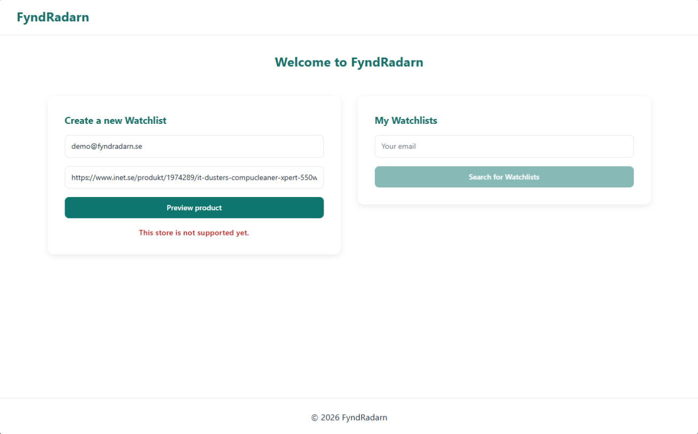
#### Confirmation email
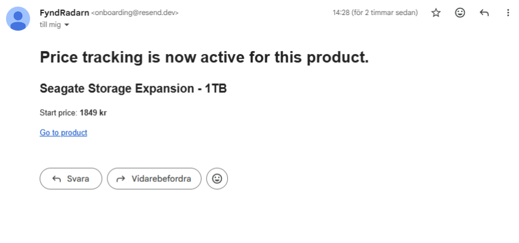
#### Price Change email
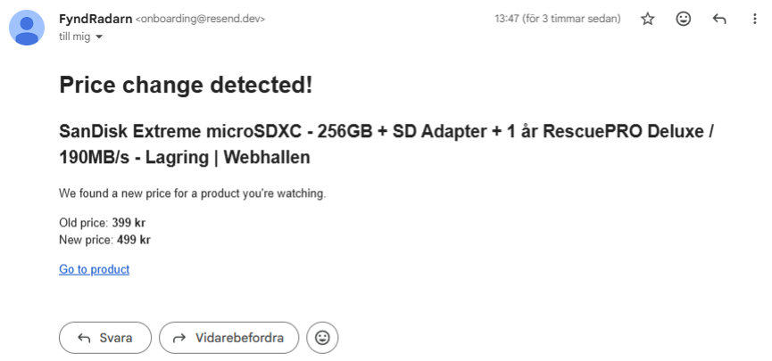

## License

This project is intended for educational and portfolio purposes.
